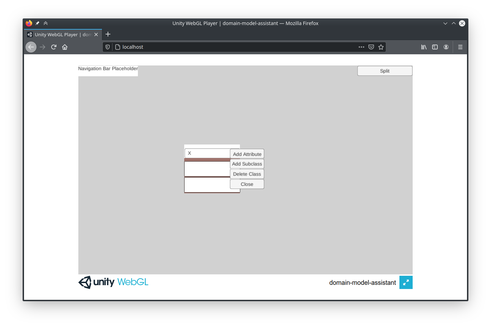

# Unity WebGL Apache Server Setup

The following instructions describe how to setup a local Apache server for the Unity WebGL Domain Modeling Assistant.
They have been tested with Apache 2.4.41 and Chrome and Firefox on Linux (Ubuntu 20.04),
but they should also work with other modern browsers and on Windows and macOS.
For simplicity, these instructions assume Apache will be used to host the Unity WebGL exclusively.
To host multiple web apps, modify the instructions accordingly.

## Prerequisites

- A local, up-to-date version of this repo.
- Unity with WebGL enabled.
- Apache 2.4 or higher installed on local machine. Keep track of where it is installed.
- A text web browser that runs in the terminal, such as **links**. This is used by Apache.
You can install links with `sudo apt-get install -y links`.

## Steps

1. Build the WebGL project in Unity. Keep track of the WebGL output folder.
1. Run `sudo a2enmod mime` to enable [MIME](https://developer.mozilla.org/en-US/docs/Web/HTTP/Basics_of_HTTP/MIME_types).
1. Run `sudo a2enmod headers` to enable HTTP headers.
1. Edit the `apache2.conf` file (eg, `sudo nano /etc/apache2/apache2.conf`) as follows.
In the `Directory`s section, add the following entry, changing the path accordingly
(the `/` at the end of the path matters):

    ```ApacheConf
    <Directory /ABSOLUTE/PATH/TO/UNITY/WEBGL/OUTPUT/>

      # TODO Secure this once no longer using localhost
      Header set Access-Control-Allow-Origin "*"

      Options Indexes FollowSymLinks
      AllowOverride All
      Require all granted
      
      # From https://docs.unity3d.com/2020.1/Documentation/Manual/webgl-server-configuration-code-samples.html
      #
      # This configuration has been tested with Unity 2020.1 builds, hosted on Apache/2.4
      # NOTE: "mod_mime" Apache module must be enabled for this configuration to work.
      <IfModule mod_mime.c>

        # The following lines are required for builds without decompression fallback, compressed with gzip
        RemoveType .gz
        AddEncoding gzip .gz
        AddType application/octet-stream .data.gz
        AddType application/wasm .wasm.gz
        AddType application/javascript .js.gz
        AddType application/octet-stream .symbols.json.gz

        # The following lines are required for builds without decompression fallback, compressed with Brotli
        RemoveType .br
        RemoveLanguage .br
        AddEncoding br .br
        AddType application/octet-stream .data.br
        AddType application/wasm .wasm.br
        AddType application/javascript .js.br
        AddType application/octet-stream .symbols.json.br

        # The following line improves loading performance for uncompressed builds
        AddType application/wasm .wasm

        # Uncomment the following line to improve loading performance for gzip-compressed builds with decompression fallback
        AddEncoding gzip .unityweb

        # Uncomment the following line to improve loading performance for brotli-compressed builds with decompression fallback
        # AddEncoding br .unityweb
        
        
        # From https://forum.unity.com/threads/compressed-webgl-build-fails-loading.1040041/
        #
        <FilesMatch "\.(data.gz)$">
          Header set Content-Type "application/octet-stream"
        </FilesMatch>
        
      </IfModule>
    </Directory>
    ```

1. Modify the `DocumentRoot` in `/etc/apache2/sites-available/000-default.conf` to point to the same
   `/ABSOLUTE/PATH/TO/UNITY/WEBGL/OUTPUT/` (or a valid parent folder).
   To setup multiple DocumentRoots, see the Apache documentation.
1. Run `sudo apachectl start` to start the server.
1. Navigate to `localhost` using a web browser. You should see something resembling the following image.

   

1. To stop running the Apache server, run `sudo apachectl stop`.
