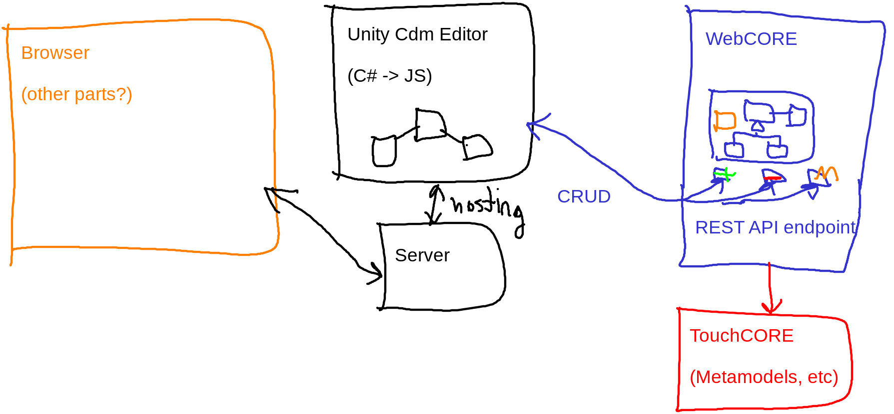

# Implementation Details

This file contains implementation details for the Domain Modeling 
Assistant application.

## System Architecture

_TODO: Make a more formal figure and add descriptions._

## Control Flow

The control flow of the application is illustrated with the following
example that shows how to add a class.

1. The user selects the `Add Class` button in the frontend.
This button is associated with
[`AddClassAction.AddClass()`](../domain-model-assistant/Assets/Components/Scripts/AddClassAction.cs)
in the Unity Editor.

The one thing not mentioned above is how an external webpage could 
communicate with the frontend application.

